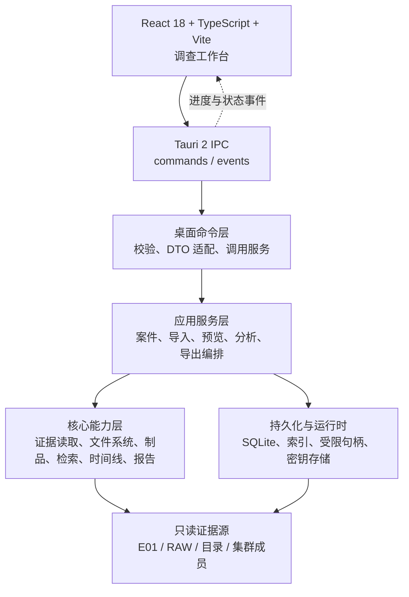
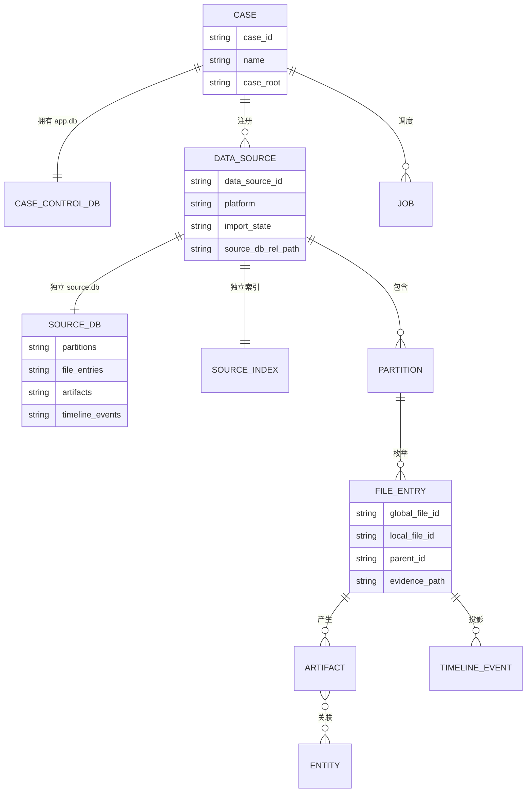
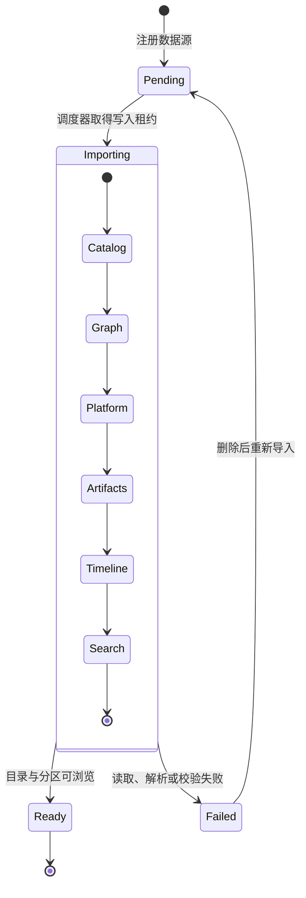
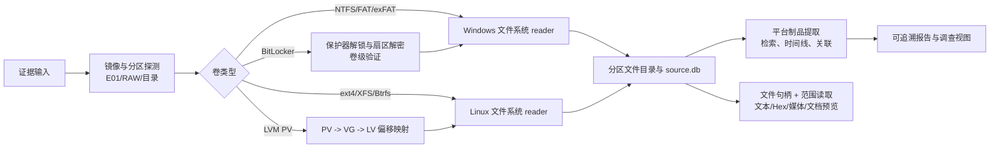
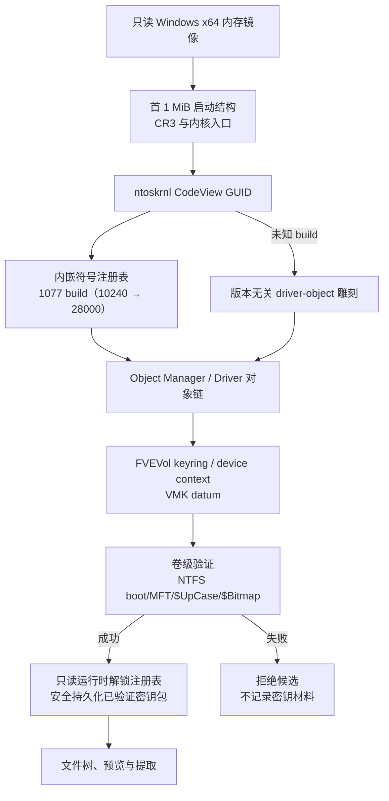

# Meow~Detective


## 项目介绍

Meow~Detective 面向磁盘镜像、逻辑目录与 Linux/PVE 证据源的本地离线分析。后端 workspace 当前包含 39 Rust crates。案件控制信息和每个数据源的取证数据分库存储：案件级数据库负责案件、数据源注册、任务和审计；分区、文件树、制品、时间线和源内索引保存于对应数据源的 `source.db`；可重建的案件级跨源关系投影保存于 `indexes/case-graph.db`。

当前工程事实快照：11 frontend pages、130 Tauri commands、33 source modules、migration scripts (83)、112 test files。计数由 `scripts/check-doc-drift.ps1` 与仓库结构同步校验。

> [!IMPORTANT]
> **Windows 权限与系统服务特别说明**：发布版桌面应用使用 Windows manifest 的
> `requireAdministrator`，启动时会触发 UAC 并以管理员令牌运行。物理磁盘挂载会使用系统
> `MSiSCSI` 服务；应用可能在挂载期间临时启动该服务，并在服务租约结束后恢复由应用自身
> 修改的启动类型。应用不会自动安装 Dokan 或 iSCSI 组件，也不会强制停止可能被其他程序
> 使用的 `MSiSCSI` 服务。详细边界见下文 [Windows 权限与系统服务](#windows-权限与系统服务)。

## 功能简介

### 证据导入与文件浏览

- 支持 E01、RAW/dd、逻辑目录及 Linux 集群目录作为数据源入口。
- 自动识别 MBR/GPT、常见分区与文件系统；支持 NTFS、FAT、exFAT、ext4、XFS、Btrfs 以及 Linux LVM 直接逻辑卷映射。
- 文件树、目录分页、筛选、自然排序、文件属性与数据源分区信息均由后端统一提供。
- 文本、Hex、图片、音视频、PDF/Office/SQLite 等预览走受限的只读证据读取链路；大文件使用范围读取，避免一次性载入完整文件。
- 支持向调查员指定的路径提取文件，默认禁止覆盖，提取过程返回真实进度和完整性信息。
- 提供 NTFS、ext4 与 XFS 的删除文件恢复/雕刻能力，恢复范围和完整性状态会显式标注。
- 镜像挂载提供逻辑分区和完整物理磁盘两种只读模式；逻辑分区通过 Dokan Mount Manager
  发布为普通资源管理器可见的只读盘符，物理磁盘模式通过本机回环 iSCSI 交给 Windows
  原生卷管理，不依赖自写驱动或 Arsenal 授权。

### Windows 权限与系统服务

这是挂载功能的运行前置和系统影响边界，使用前应明确区分两种模式：

| 范围 | 权限/服务要求 | 应用行为 | 退出与恢复边界 |
|---|---|---|---|
| 桌面应用 | 发布版需要管理员令牌 | 启动时由 UAC 授权，不在运行中静默提权 | 拒绝 UAC 后无法启动桌面应用 |
| 逻辑分区挂载 | 需要预先安装 Dokan runtime/driver | 使用 Dokan `Mount Manager` 发布全局只读盘符；不使用 `CURRENT_SESSION`，不修改 Windows 服务 | 应用负责卸载并清理挂载；Dokan 未安装时返回明确错误，不静默调用外部挂载工具 |
| 物理磁盘挂载 | 需要管理员令牌和 Microsoft iSCSI Initiator (`MSiSCSI`) | 通过本机 loopback iSCSI 将 E01/RAW 只读字节流交给 Windows；不安装自写驱动、不依赖 Arsenal 授权 | 首个物理挂载建立服务租约；最后一个挂载释放后恢复应用临时修改的启动类型，不强制停止服务 |
| `MSiSCSI` 已禁用 | 需要服务配置权限 | 挂载前临时改为 `Manual` 并启动；仅由应用持有的租约负责恢复 | 若其他程序同时改变配置，应用保留外部修改；应用崩溃或被强制终止后需管理员复核服务启动类型 |
| Windows Search (`WSearch`) | 不修改系统服务 | 逻辑挂载的虚拟文件节点声明 `NOT_CONTENT_INDEXED`，减少宿主索引对目录回调的争用 | 不停止、不禁用、不修改全局搜索策略 |

无论哪种模式，原始证据始终只读；服务启动类型、挂载生命周期和错误状态由后端维护，前端只显示后端返回的状态。常规 Rust 测试使用非提权测试 manifest，不需要 UAC；只有桌面应用启动、Dokan 互操作和物理 iSCSI 互操作测试需要管理员权限。

### Windows 取证分析

- 注册表：SYSTEM、SOFTWARE、NTUSER、SAM、SECURITY、USRCLASS、Amcache 与事务日志基础解析。
- 事件日志：EVTX 解析、开关机、登录、进程、账户与应用事件分类。
- 用户行为：Prefetch、LNK、Jump List、Recycle Bin、SRU、Thumbcache、浏览器历史/下载/会话等。
- 浏览器与凭据：Chrome、Edge、Firefox 浏览器数据提取；离线 DPAPI 相关链路按前置材料与支持边界处理。
- BitLocker：卷元数据检查、密码/恢复密码解锁、已验证密钥安全存储及重开案件恢复；匹配的 Windows x64 内存镜像可用于受限的密钥恢复与卷级验证，定位链路经内嵌的 1077 build 内核符号注册表（Windows 10 10240 → Windows 11 28000），不绑定单一 Windows 版本。

### Linux 与 PVE 分析

- Linux 取证能力：systemd journal、wtmp、bash history、apt/dpkg/yum/dnf、cron、sudo/auth、系统配置、Nginx/Apache 站点与日志、MySQL/MariaDB 配置和日志。
- Linux 数据源自动进入独立分析视图；Windows 与 Linux 提取能力不会交叉调度。
- PVE/Ceph 相关能力包括成员发现、宿主 LVM/ext4、BlueStore/BlueFS/RocksDB 元数据读取、RBD 派生虚拟磁盘与文件预览。该部分仍以私有真实样本基线为主，完整 CRUSH/EC、降级副本、通用 CephFS 重建等场景尚未承诺支持。

### 仿真取证

- E01/RAW 镜像通过写时复制（COW）overlay 直通给虚拟机：guest 的全部写入只落入单次会话的 overlay 日志，原始证据保持只读；会话结束后 overlay 不复用，崩溃语义等同于物理机断电丢失未落盘写入。
- 应用生成 VMware 材料（VMDK 描述文件与 VMX 配置），并通过 `vmrun` 直接启动、软关机和释放仿真会话；需要用户自行安装 VMware Workstation，应用不捆绑或再分发 VMware 组件。
- 预检直接消费镜像导入阶段已建立的全局索引，不重复扫描镜像：Windows 检查注册表配置单元与启动风险，Linux 识别发行版、根文件系统与 LVM 布局并给出启动路线建议。
- 维护引导 ISO 由应用内生成并可在 UI 探测存在性；guest 侧工具完成 OSDATA 命名空间筛查清除。登录绕密在主机侧通过 COW overlay 写入：Windows 支持 SAM 与 Utilman 绕密，Linux 支持 `/etc/shadow` 绕密，另提供 GRUB 引导参数的手册路线。
- 虚拟机配置由用户显式选择：CPU 核心数与内存滑块、NAT/桥接网络模式、剪贴板与文件夹共享等隔离选项均以勾选框呈现。

### 调查、关联与输出

- 全文检索、时间线、实体归并、关联图、Notebook 调查记录、规则包与批处理任务。
- HTML、CSV、JSON 与证据包报告导出；报告和错误信息遵循脱敏规则。
- MCP 扩展通道使用受控权限模型，默认最小权限和审计记录。

## 支持边界

| 范围                  | 当前状态 | 说明                                              |
| ------------------- | ---- | ----------------------------------------------- |
| Windows / Linux 数据源 | 支持   | 以 Windows 为主，Linux 文件系统与取证能力按解析器分别标注成熟度。        |
| macOS / APFS / HFS+ | 不支持  | 可识别部分分区类型，但不创建文件系统 reader。                      |
| PVE / Ceph          | 实验性  | 已覆盖私有样本中的部分 BlueStore、RBD 与派生 VM 文件树；不宣称通用集群重建。 |
| BitLocker           | 部分支持 | 仅在受支持加密方法、保护器和可验证密钥材料范围内可用。                     |
| 仿真取证               | 部分支持 | 仅 VMware Workstation 后端；Windows 与 Linux 镜像可仿真；btrfs 根卷不支持主机侧绕密编辑。 |
| 原始证据写入              | 禁止   | 系统仅读取原始证据；派生数据写入案件工作区或调查员显式选择的导出目录。             |

完整的解析器成熟度、样本基线和已知限制见 [解析器支持矩阵](docs/parser-support-matrix.md) 与 [已知不支持格式](docs/known-unsupported-formats.md)。

## 架构图

### 分层架构



### 案件与数据源模型



全局文件 ID 采用 `ds:<dataSourceId>:<localId>` 形式。前端只接收 DTO 和逻辑 ID，不接触主机原始路径或数据库物理路径。

### 导入状态与处理阶段



`ready` 表示文件目录已可浏览；Catalog、Graph、Platform、Artifacts、Timeline、Search 的完成情况分别记录，避免把“已导入”误判为“所有分析已完成”。

## 模型与算法图

### 证据解析与预览算法链路



关键算法约束：I/O 密集的镜像读取保持有界和顺序化，CPU 密集的独立解析任务可使用 Rayon 并行；SQLite 每个数据源单写者、多读者；大文件预览和媒体读取使用范围请求与短生命周期句柄。

### BitLocker 内存辅助验证模型



该链路不把 FVEK、VMK 或未验证候选写入日志、报告、案件数据库或前端。只有经过卷级认证的运行时解锁状态才可用于后续只读访问；内存解锁 command 只返回卷状态。恢复密码反推在反向 datum 与内存 VMK 同代时成立并以 recovered 呈现，不同代时显式报 unavailable，不提供用户密码恢复 command、DTO 或 UI。

## 开发模式运行

### 环境要求

- Windows 10/11 x64。
- Rust stable（仓库的 `rust-toolchain.toml` 为准）。
- Node.js LTS、Corepack 与 pnpm `10.25.0`。
- Visual Studio 2022 Build Tools，安装 Desktop development with C++ 和 Windows SDK。
- WebView2 Runtime（Tauri 桌面运行时需要）。
- 仿真取证功能需要用户自行安装 VMware Workstation（含 `vmrun`）；不使用仿真时无此前置。
- 发布版应用清单请求管理员权限，启动时会显示 UAC；挂载模式、Dokan 前置和
  `MSiSCSI` 服务租约的详细边界见 [Windows 权限与系统服务](#windows-权限与系统服务)。

涉及链接的 Rust 命令应在 **x64 Native Tools Command Prompt for VS 2022** 或已执行 `vcvars64.bat` 的终端中运行，避免误用 Git 自带的 `link.exe`。
管理员 manifest 仅链接最终桌面 binary；Rust 测试 harness 使用独立的非提权 Common Controls
manifest，因此常规 `cargo test` 不需要 UAC。只有启动桌面应用和物理磁盘挂载互操作测试需要管理员权限。

### 安装依赖

```powershell
corepack enable
pnpm --dir frontend install --frozen-lockfile
cargo fetch
```

### 启动完整桌面开发模式

在仓库根目录执行：

```powershell
Set-Location apps/desktop/src-tauri
cargo tauri dev
```

该命令启动 Tauri 桌面应用，并使用 Vite 前端热更新。前端页面不提供独立 mock 模式；单独运行 `pnpm --dir frontend dev` 仅适合样式和组件开发，不能替代完整的取证 IPC 运行环境。

### 前端单独检查

```powershell
pnpm --dir frontend typecheck
pnpm --dir frontend lint
pnpm --dir frontend test
pnpm --dir frontend build
```

### Rust 后端检查

```powershell
cargo fmt --all -- --check
cargo clippy --workspace --all-targets -- -D warnings
cargo test --workspace
cargo check -p forensics-desktop
```

### 构建发布包

```powershell
pnpm --dir frontend build
Set-Location apps/desktop/src-tauri
cargo tauri build
```

`tauri.conf.json` 将生产前端目录固定为 `frontend/dist`，因此发布构建前必须先完成前端构建。

## 工程结构

| 路径 | 职责 |
|---|---|
| `frontend/` | React 18、TypeScript、Vite、Tailwind 4 调查界面与前端测试。 |
| `apps/desktop/src-tauri/` | Tauri shell、命令薄适配器、事件桥接和桌面运行时。 |
| `crates/transport/` | Rust DTO、请求、事件与错误契约的唯一事实源。 |
| `crates/app-services/` | 案件、导入、预览、分析、BitLocker、恢复、导出等用例编排。 |
| `crates/persistence-sqlite/` | SQLite 迁移、仓储与 source-local 数据库访问。 |
| `crates/evidence-core/`、`image-e01/` | 证据 reader、镜像探测、分区和 E01 读取。 |
| `crates/fs-*/`、`fs-lvm/` | NTFS/FAT/exFAT/ext4/XFS/Btrfs 与 LVM 文件系统能力。 |
| `crates/artifacts-windows/`、`artifacts-linux/` | Windows 和 Linux 取证制品解析。 |
| `crates/search/`、`timeline/`、`reports/` | 检索、时间线和报告能力。 |
| `crates/ceph-wire/`、`rocksdb-wire/` | 只读 Ceph/BlueStore/RocksDB 低层解析原语。 |
| `crates/evidence-emulation/`、`winpe-maintenance/` | COW 虚拟磁盘、VMDK/VMX/ISO9660 材料生成，以及维护引导 ISO 的 guest 侧工具。 |
| `docs/` | 支持矩阵、测试基线、错误分类、安全和前后端契约。模块设计与开发文档仅保留在工作站。 |
| `scripts/` | 架构边界、质量门禁、真实样本回归和基准脚本。 |

## 质量与安全约束

- Rust DTO 必须定义在 `crates/transport/src/dto/`，前端 TypeScript 镜像需要手工同步。
- 页面不得直接调用 Tauri `invoke`；所有请求必须经由 `frontend/src/lib/api/`。
- 原始证据只读；预览不能通过拼接宿主路径访问证据内容。
- 导出前校验目标路径，默认 `overwrite=false`，使用临时文件和原子改名避免半成品。
- 生产代码与测试物理分离；后端模块、函数、命令边界均由仓库 PowerShell guard 检查。

完整门禁、真实样本测试和文档索引见 [验证可信框架](docs/validation-trust-framework.md) 与 [文档索引](docs/documentation-index.md)。

### 技术文档

- [预期 JSON 契约](docs/expected-json-contract.md)
- [错误分类手册](docs/error-classification-manual.md)
- [性能基线](docs/benchmark-baseline.md)
- [解析器支持矩阵](docs/parser-support-matrix.md)
- [MCP 安全模型](docs/mcp-security-model.md)
- [导出与媒体安全](docs/export-and-media-safety.md)

性能门禁的结构化事实源为 `testdata/governance/v2-benchmark-baseline.json`。

## 许可证

本项目采用 [MIT License](LICENSE)；如仓库未包含独立许可证文件，以根目录 `Cargo.toml` 中的 `license = "MIT"` 声明为准。

## 致谢与第三方版权声明

本项目在设计与实现过程中借鉴或学习了以下开源项目，特此致谢。各项目的许可证文本归其原作者所有；本项目对它们的使用仅限于设计思想参考、受控适配或许可证允许的代码复用。

| 项目 | 许可证 | 借鉴/使用方式 |
|---|---|---|
| [Autopsy](https://github.com/sleuthkit/autopsy) | Apache-2.0 | 数字取证工作台的能力分层与工作流闭环（案件 → 数据源 → 文件浏览 → 工件提取 → 检索 → 时间线 → 报告）的产品与架构思想参考；未复用其源码 |
| [The Sleuth Kit](https://github.com/sleuthkit/sleuthkit) | IPL-1.0 / CPL-1.0 | BitLocker 卷侧 `metadata -> VMK -> FVEK -> sector reader` 处理顺序与元数据冗余策略的正确性参照；未复用其源码 |
| [Dokany](https://github.com/dokan-dev/dokany) / [dokan-rust](https://github.com/dokan-dev/dokan-rust) | Dokany runtime/driver: LGPL；Rust binding: MIT | Windows 逻辑分区只读盘符的用户态文件系统 runtime 与 Rust API；本项目不自动安装或再分发 Dokany runtime，挂载前置要求见本文 Windows 权限与服务章节 |
| [libewf](https://github.com/libyal/libewf) | LGPL-3.0 | 参考 `ewfmount.c`、Dokan/FUSE 回调和 EWF handle 生命周期设计，确定最小只读操作集、句柄边界与卸载清理；生产链路使用本项目 `image-e01` reader，未复用 libewf 源码或调用其 CLI |
| [iscsi-target](https://github.com/lawless-m/iscsi-crate) | MIT OR Apache-2.0 | 物理磁盘模式的本机 loopback iSCSI target 基础实现；仓库在 `vendor/iscsi-target` 保留许可证并增加写保护 SCSI 与 Windows 互操作补丁，修改说明见 `vendor/iscsi-target/MEOW_PATCH.md` |
| [Microsoft Windows iSCSI API](https://learn.microsoft.com/windows/win32/iscsi/portal) | Microsoft Learn / Windows SDK 使用条款 | 物理挂载使用系统 `iscsidsc.dll`、Microsoft iSCSI Initiator 和 Service Control Manager API；不复制或分发 Windows 组件，服务修改范围见本文“Windows 权限与系统服务” |
| [omerbenamram/EVTX](https://github.com/omerbenamram/EVTX) | MIT OR Apache-2.0 | `crates/evtx-patched` 为其本地补丁分支（去除失维护依赖），上游许可证文本保留于 `crates/evtx-patched/LICENSE-APACHE` 与 `crates/evtx-patched/LICENSE-MIT` |
| [SecurityRonin/bitlocker-forensic](https://github.com/SecurityRonin/bitlocker-forensic)（含 [elephant-diffuser](https://github.com/SecurityRonin/elephant-diffuser)） | Apache-2.0 | `crates/volume-bitlocker` 派生自 bitlocker-core 0.3.5 与 elephant-diffuser（Albert Hui 著）。上游许可证文本保留于 `crates/volume-bitlocker/LICENSE-APACHE-2.0-UPSTREAM`，修改声明（Apache-2.0 §4(b)）与逐文件来源校验见 `crates/volume-bitlocker/NOTICE` 和 `docs/bitlocker-dependency-decision.md` |
| [shadcn/ui](https://ui.shadcn.com/) | MIT | 前端 `frontend/src/app/components/ui/` 的 UI 原语组件集（Radix Slot + cva + `cn()` 结构，已按本项目主题改写），见 `frontend/ATTRIBUTIONS.md` |
| [winbindex](https://github.com/m417z/winbindex) | GPL-3.0 | ntoskrnl 各 build 元数据索引，作为内嵌内核符号注册表的采集入口（配合微软公共符号服务器 PDB），见 `crates/memory-windows/symbols/README.md`；仅消费其公开索引数据，未复用其源码 |

此外，DPAPI / TBAL 离线恢复链路参考了公开研究（[TBAL: an (accidental?) DPAPI Backdoor for local users](https://vztekoverflow.com/2018/07/31/tbal-dpapi-backdoor/) 与 [pypykatz](https://github.com/skelsec/pypykatz) 的算法说明），仅作算法对照，未复用其代码。仿真取证的绕密与维护引导设计（SAM/Utilman 绕密、OSDATA 命名空间处理、Linux `/etc/shadow` 编辑与 GRUB 单用户路线）参考了公开技术资料中的通用技术原理，实现为本项目独立代码。
