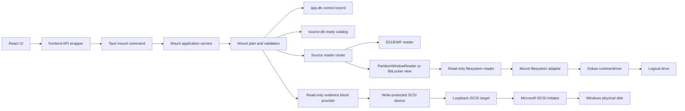
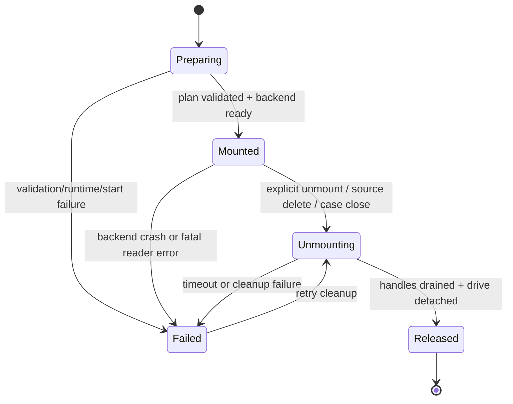

# 镜像只读挂载设计

## 1. 文档状态

- 状态：逻辑分区模式已验收；物理磁盘模式已通过管理员 Windows 互操作验收
- 适用版本：Meow~Detective 当前开发基线 `4504daa0`
- 范围：E01/EWF 和 raw 镜像的单分区逻辑挂载，以及完整逻辑字节流的只读物理磁盘呈现
- 首选宿主平台：Windows x64
- 证据原则：原始镜像和其 EWF segment 永不写入
- Windows 应用清单：桌面程序请求 `requireAdministrator`，启动时由 UAC 授予管理员令牌；
  这是物理磁盘模式调用 Microsoft iSCSI Initiator 所需的固定运行前提，不通过运行时自提权。
- 构建资源隔离：管理员 manifest 只链接 `forensics-desktop` binary；Rust 测试 harness 使用
  独立的非提权 Common Controls v6 manifest，默认质量门禁不需要以管理员身份执行。
- MSiSCSI 服务：若服务已安装但启动类型为 `Disabled`，物理挂载会临时改为 `Manual` 并启动；
  进程内最后一个物理挂载释放后恢复原启动类型，不强制停止可能被其他程序使用的服务。
  异常退出属于恢复边界外场景，启动类型需要由系统管理员复核。

本设计定义挂载模块的边界、实现状态和落地顺序，不改变现有文件树、预览、BitLocker、
独立 source database 或 Ceph/PVE 解析语义。当前核心只读语义、source catalog 路由、
Windows Dokan backend 和案件生命周期清理已经落地；已在 Dokan 2.3.1 环境中完成真实
E01 的 FAT 与 NTFS 盘符读取、目录列举、写入拒绝和卸载释放验收。新增物理磁盘模式
不依赖 Arsenal 授权或自签名驱动：后端把 E01/raw 逻辑字节流作为只读 SCSI block device，
通过仅绑定 `127.0.0.1` 的临时 iSCSI target 交给 Microsoft iSCSI Initiator。

## 2. 目标与非目标

### 2.1 目标

用户可以选择一个已经导入且状态为 `ready` 的数据源，并明确选择两种互不回退的模式：

- `logicalPartition`：选择一个分区，以只读逻辑盘符挂载；文件访问由本项目 parser 和
  source database 路由。由于桌面进程默认提权，Dokan 必须通过 Mount Manager 发布全局
  盘符，不得使用仅提权会话可见的 `CURRENT_SESSION`；
- `physicalDisk`：不选择分区，把完整 E01/raw 逻辑字节流呈现为 Windows 物理磁盘，
  由 Windows 原生发现 MBR/GPT 及其可识别卷。

v1 必须具备：

- E01/EWF 多 segment 的只读随机读取；
- 一个挂载实例只绑定一个 `data_source_id + partition_index`；
- 已支持的 NTFS、FAT、exFAT、ext4、XFS、Btrfs 分区可以按能力矩阵挂载；
- `open/read/seek/stat/readdir` 等只读操作；
- mount、status、unmount、case-close cleanup 的可控生命周期；
- 读请求大小、并发数、打开句柄数和缓存大小均有上限；
- 错误、状态和挂载能力通过 typed DTO 返回，不让前端计算分区或宿主路径；
- 审计记录包含来源、分区、挂载实例、只读策略和失败原因，但不保存密钥或完整证据路径。
- 物理模式使用每次挂载独立 IQN 和仅驻留内存的 CHAP 凭据；target 只监听 loopback；
- 临时 CHAP secret 固定为 Windows 接受的 16 字节上限，不写入数据库、日志或 DTO；
- SCSI `WRITE(10/16)` 返回 `DATA PROTECT / WRITE PROTECTED`，MODE SENSE 同时报告 WP；
- 物理模式通过 `iscsidsc.dll` 登录和注销，不调用 PowerShell、diskpart 或外部 mount CLI。

### 2.2 非目标

以下能力不在本轮 v1：

- 自写、侧载或分发未签名虚拟磁盘驱动；
- 依赖 Arsenal Image Mounter 授权或其专有 backend；
- 写入证据、回写元数据、删除/重命名/创建文件；
- 自动调用 `ewfmount`、`libewf` CLI、`ceph-fuse`、`mount.ceph`、`rbd map`、`qemu-nbd`；
- Ceph BlueStore、CephFS、PVE 多成员集群作为一个宿主卷挂载；
- 通过全盘扫描补齐尚未导入的文件树；
- 在案件重新打开后恢复旧的宿主挂载句柄；
- 将 BitLocker 密码、recovery key、VMK 或 FVEK 放入 DTO、日志或 source database。

## 3. 事实依据与技术结论

### 3.1 本项目现有能力

当前 `evidence-core::FileSystemReader` 已定义：

- `root`：返回根节点和大小、时间、隐藏/系统/加密属性；
- `list_children`：按相对路径列举子节点；
- `open_file`：打开文件的只读流；
- `open_file_seekable`：对支持随机访问的文件提供 `Read + Seek`；
- `read_file_range`：有界范围读取；
- diagnostics 和 locator cache：报告解析损坏并复用已验证的文件系统定位信息。

`image-e01::E01Reader` 已具备多 segment chunk table、压缩 chunk 解码、独立文件句柄
重开和 `Read + Seek`。`PartitionWindowReader` 已能把镜像中的 `[offset, length]`
变成零起点、边界受限的块视图。文件预览链路则已经通过 source database、分区候选、
filesystem locator 和 `FileEntryId` 路由，不能被挂载模块绕过。

这些事实说明：挂载模块可以复用现有 reader，但需要增加“挂载适配器”能力，不能把
挂载代码塞进 `image-e01` 或 `file_service` 的预览函数中。

### 3.2 对 libewf `ewfmount` 的源码比对

libewf 的 `ewftools/ewfmount.c` 负责解析命令行、打开 EWF source、创建 FUSE/Dokan
后端并运行生命周期循环。它把 libewf handle 交给回调层，并没有实现 NTFS、ext4 或
分区语义。

其实际回调边界可以在以下源码中核对：

- 主程序和后端选择：
  [`ewfmount.c`](https://github.com/libyal/libewf/blob/main/ewftools/ewfmount.c)
- Dokan 的 `CreateFile`、`ReadFile`、`FindFiles`、文件信息和卷信息：
  [`mount_dokan.c`](https://github.com/libyal/libewf/blob/main/ewftools/mount_dokan.c)
- FUSE 的 `open/read/release/opendir/readdir/getattr/destroy`：
  [`mount_fuse.c`](https://github.com/libyal/libewf/blob/main/ewftools/mount_fuse.c)
- 打开句柄、按路径查找、关闭和最大打开句柄数：
  [`mount_handle.c`](https://github.com/libyal/libewf/blob/main/ewftools/mount_handle.c)
- 文件系统句柄和目录/文件条目管理：
  [`mount_file_system.c`](https://github.com/libyal/libewf/blob/main/ewftools/mount_file_system.c)

源码可证明的可借鉴点：

1. 后端只需要实现最小读取操作集；Dokan/FUSE 操作表将写入、删除、重命名和属性写入
   回调设为空或不注册。
2. 文件/目录句柄与路径解析分离，回调通过句柄读取，而不是每次重新打开整个镜像。
3. 挂载销毁回调必须关闭 EWF handle、释放文件条目和终止等待中的读取。
4. 卷信息必须声明 `FILE_READ_ONLY_VOLUME`，但该标记只能作为系统提示，不能替代每个
   写操作的拒绝检查。
5. 最大打开句柄和异常 abort 是挂载生命周期的一部分，不应由 UI 或 shell 脚本承担。

不可直接照搬的部分：

- libewf 以 EWF 连续字节流作为根目录，显示的是 EWF 的逻辑文件接口，不是内部分区的
  文件树；本项目必须绑定分区并使用本项目的 FS reader。
- libewf 的 C handle 不是本项目的 source DB 全局 ID；本项目必须使用
  `ds:<dataSourceId>:<localId>` 和持久化 locator，禁止将宿主路径当作文件身份。
- libewf 可以依赖系统 FUSE/Dokan 配置；本项目必须由后端显式检查 runtime、版本和
  驱动状态，不能在失败时静默切换到宿主挂载命令。

### 3.3 挂载语义选择

| 方案 | 输出 | 优点 | 风险/成本 | 决策 |
|---|---|---|---|---|
| Dokan 用户态文件系统 | 逻辑盘符/目录 | Windows 生态成熟，Rust wrapper 为 MIT；读写边界可控 | 需要 Dokan runtime/driver 和发布验证 | **v1 首选** |
| WinFsp 用户态文件系统 | 逻辑盘符/目录 | 可作为后续可替换 backend | 当前 Rust binding 存在 GPL 合规风险 | 后续评估，不进入 v1 |
| EWF 连续流 + loopback iSCSI | Windows 物理磁盘 | 使用 Microsoft 已签名 Initiator，无自写驱动；系统原生发现分区 | 需要 MSiSCSI 服务和管理员进程 | **物理模式初版** |
| 外部 `ewfmount`/第三方工具 | 依赖外部挂载点 | 开发快 | 绕过本项目 source routing，权限/生命周期/路径审计不可控 | 禁止作为生产路径 |

逻辑模式的“逻辑分区”是 Dokan 用户态文件系统映射出来的逻辑盘，不宣称是磁盘管理器
意义上的物理卷。WinFsp 只作为后续可替换 backend，不在 v1 同时维护两套 backend。
Dokan runtime/driver 未安装时必须返回 typed external/unsupported 错误，不允许静默回退。
依赖原生卷识别的工具应选择物理模式；该模式只承诺只读磁盘呈现，不承诺绕过 Windows
自身对未知文件系统、离线 SAN 策略或加密卷的限制。

### 3.4 Windows iSCSI API 依据

物理模式只使用 Windows iSCSI Discovery Library API，不通过 shell 间接调用：

- [`ISCSI_LOGIN_OPTIONS`](https://learn.microsoft.com/windows/win32/api/iscsidsc/ns-iscsidsc-iscsi_login_options)
  定义 CHAP 用户名、共享密钥和 login flags；
- [`LoginIScsiTargetW`](https://learn.microsoft.com/windows/win32/api/iscsidsc/nf-iscsidsc-loginiscsitargetw)
  与 [`LogoutIScsiTarget`](https://learn.microsoft.com/windows/win32/api/iscsidsc/nf-iscsidsc-logoutiscsitarget)
  定义临时会话生命周期；
- [`QueryServiceConfigW`](https://learn.microsoft.com/windows/win32/api/winsvc/nf-winsvc-queryserviceconfigw)
  与 [`ChangeServiceConfigW`](https://learn.microsoft.com/windows/win32/api/winsvc/nf-winsvc-changeserviceconfigw)
  用于检测并临时调整 `MSiSCSI` 启动类型；
- [`GetDevicesForIScsiSessionW`](https://learn.microsoft.com/windows/win32/api/iscsidsc/nf-iscsidsc-getdevicesforiscsisessionw)
  返回会话对应的物理设备路径；
- Windows 的 [`CHAP shared-secret`](https://learn.microsoft.com/windows/win32/api/vds/ns-vds-vds_iscsi_shared_secret)
  契约要求长度为 12 至 16 字节，本实现使用随机 16 字节 secret，并且不进入 DTO、审计
  或持久化存储。

## 4. 目标架构



依赖方向固定为：

```text
transport -> mount service -> evidence-mount adapter
                         -> app-services source routing
evidence-mount -> evidence-core / domain
physical-mount -> evidence-block -> image-e01 / evidence-core
Tauri command -> app-services / transport
frontend -> transport mirror / API wrapper
```

`evidence-mount` 不依赖 Tauri、前端、SQLite repository 或宿主文件路径解析。它只接收
一个已验证的 `MountFileSystem` trait 实现和后端分配的 mount identity。

### 4.1 建议目录

```text
crates/evidence-mount/
  src/
    lib.rs
    error.rs
    identity.rs
    path.rs
    policy.rs
    filesystem.rs
    session.rs
  tests/unit.rs

crates/evidence-block/
  src/
    device.rs
    e01.rs
    raw.rs
    geometry.rs
    provider.rs

crates/physical-mount/
  src/
    target.rs
    windows_initiator.rs
    windows_service.rs
    lifecycle.rs

crates/transport/src/dto/mount.rs
crates/app-services/src/mount_service/
  mod.rs
  cache.rs
  catalog.rs
  directory_cache.rs
  filesystem_factory.rs
  handle.rs
  open.rs

apps/desktop/src-tauri/src/
  mount_registry.rs
  physical_mount_registry.rs
  mount_backend/mod.rs
  mount_backend/dokan.rs
  commands/mount_commands.rs
```

`vendor/iscsi-target` 固定为 crates.io `iscsi-target 1.0.0` 的受控补丁。上游版本会接受
WRITE command、在 MODE SENSE 中报告可写，并错误复用 Data-In status/residual 字节，不能
直接用于取证或 Windows Initiator。补丁增加 read-only trait、write-protected sense、WP bit、
pre-bound listener、RFC 7143 residual 编码和独立 status 字段；不得承载本项目解析逻辑。

每个生产文件只拥有一个 use case 或稳定能力。`mod.rs/lib.rs` 只做声明和 re-export；
测试正文不回到 `src/`。

### 4.2 MountFileSystem 适配器

适配器的稳定接口建议为：

```text
root() -> NodeMetadata
lookup(path) -> NodeMetadata
read_directory(directory_handle, cursor) -> DirectoryPage
open(path, desired_access) -> ReadHandle
read_at(handle, offset, length) -> bytes
release(handle)
```

`NodeMetadata` 仅来自 source DB 或已验证 filesystem reader：名称、目录标记、长度、
时间戳、hidden/system/encrypted/read_only 和 source-local file id。`ReadHandle` 内部
绑定 `GlobalFileId`、source fingerprint 和独立 reader，不保存宿主证据绝对路径给 FSP
回调层。

目录访问使用 source DB 构建只读目录快照。挂载准备阶段只预热根目录元数据，不读取
文件内容、不递归加载完整文件树；子目录在第一次打开时构建快照。若 source catalog
没有完整性 seal、数据源不是 `ready` 或 locator 与当前 fingerprint 不匹配，mount
command 返回明确的 `NotReady`/`StaleCatalog`，不自动启用昂贵的隐式文件系统枚举。

### 4.3 大目录枚举与缓存

Dokan 的 `FindFiles` 回调必须在一次调用中提交目录的完整子项集合。后端不能把 SQL
`OFFSET` 当作跨回调续载游标，否则 Windows 可能把单页结果视为完整目录。当前实现：

- 使用 `source_031_mount_directory_index` 覆盖父目录、数据源、分区和稳定排序字段；
- 每个目录只执行一次 children 查询，并按 `entry_type, name COLLATE NOCASE, id` 排序；
- `DirectorySnapshotCache` 用 `Arc` 保存快照，按 64 MiB 总预算淘汰；
- Dokan 在同一回调中从快照分段读取并提交全部条目；
- 快照同时提供条目元数据 lookup，避免 Explorer 属性探测重复访问 SQLite；
- 无法表示为 Windows 路径的条目按目录汇总告警，不使其余兄弟条目不可见。

真实 `hunaghe` NTFS 样本根目录包含 53,038 个可挂载条目。修复后通过 Dokan 完整
枚举耗时约 192 ms，查询计划不再出现 `USE TEMP B-TREE FOR ORDER BY`。该数字作为
回归基线，不代表所有磁盘和宿主环境的固定性能承诺。

## 5. 分区和数据源绑定

### 5.1 MountPlan

服务层在创建后端实例前生成不可变 `MountPlan`：

```text
case_id
data_source_id
partition_index
source_fingerprint
filesystem_kind
filesystem_offset
filesystem_length
source_kind: e01 | raw | bitlocker
read_policy
catalog_scope
```

生成过程必须：

1. 从 app.db 校验案件和数据源关系；
2. 从 data source storage 打开对应 source.db 的只读连接；
3. 读取唯一分区候选，拒绝缺失、重复、跨源或不支持的候选；
4. 用 source fingerprint 校验 catalog、locator、BitLocker runtime 的一致性；
5. 根据现有 `image_open`/`range_fs` 工厂打开 reader；
6. 生成 mount id 后再启动 Dokan worker。

一个 mount 只能绑定一个明确的 partition index。多分区镜像需要多个独立 mount；不能
把 `/boot`、LVM pool、root LV 拼成一个连续的虚假文件系统。

### 5.2 BitLocker

未解锁 BitLocker 分区不可挂载。已通过现有 runtime 验证并持有解密视图时，挂载的是
解密后的只读 `FileSystemReader`；mount DTO、日志、审计和 registry 只能标记
`encrypted=true`/`unlockRequired=false`，不得记录 password、recovery key、VMK/FVEK。

案件重开后运行时解密句柄不自动恢复。数据库中的持久化 key material 只能由现有
BitLocker key store 按 fingerprint 验证后重新建立 runtime；失败就返回
`UnlockRequired`，不把加密原始块误交给 filesystem adapter。

## 6. 只读策略

只读不是 UI 复选框，而是后端不可覆盖的策略。请求中的 `read_only=false` 必须直接
拒绝，v1 也可以不在 DTO 暴露该字段。

允许的操作：

- 打开已存在的文件或目录；
- 读取属性、时间、文件长度；
- 列举目录；
- 按 offset/length 读取；
- 释放句柄、查询卷信息。

拒绝的操作：

- 创建文件/目录；
- 写入、截断、扩展、刷新写缓存；
- 删除、重命名、移动、链接；
- 修改时间、属性、ACL、压缩、加密、扩展属性；
- 卷级写、格式化、锁卷和任何回写 IOCTL。

拒绝必须在三处同时存在：

1. `MountReadPolicy` 在应用服务和 adapter 入口校验；
2. WinFsp/Dokan 操作表不注册写回调；
3. 已注册的 open handle 检查 desired access，带写权限的请求返回 write-protected。

卷信息声明只读卷标志只是额外防线，不能作为唯一安全保障。

## 7. 生命周期和状态机



运行时 registry 保存：

- `MountId`、case/source/partition identity；
- drive letter 或 mount directory；
- backend process/thread handle；
- active handle count、read queue count、last activity；
- source fingerprint、catalog generation 和 state；
- cancellation/abort token。

app.db 只持久化 mount intent、状态摘要、审计和错误类别，不持久化线程句柄、FSP
句柄或明文凭据。重新打开案件时，所有旧 `Mounted` 记录先被标记为 `Released`/
`Unavailable`，再由用户显式重新挂载。

案件 close/delete、数据源删除、应用退出均必须调用统一 `mount_cleanup`：停止接收新
请求、发出 abort、等待活跃 reader drain、卸载 backend、关闭 source DB reader，最后
更新控制记录。超时不能直接清掉 registry；必须保留 `cleanup_pending`，避免留下仍占用
盘符的后台线程。

## 8. 资源和性能治理

### 8.1 读取模型

- 不把 E01 映射为全镜像内存；每次请求只读有限范围。
- `MAX_MOUNT_READ_LENGTH` 初始建议与 viewer range 上限一致，再以真实样本基准调整。
- 每个 mount 独立 bounded queue；默认最多 2 个并发读 worker，CPU 密集的解压由 reader
  内部完成，不能按每个 FSP 请求无限创建线程。
- 每个开放文件句柄最多保留一个独立 reader 或可证明安全的 reader clone；复用
  `E01Reader::try_clone/re_open` 的共享 chunk table，避免重复解析 segment metadata。
- 顺序读可以复用现有 chunk prefetch；随机读不得触发相邻大范围预取。
- 目录列举采用分页/游标和 source DB 懒加载；不得在 `readdir` 第一次调用时全树展开。

### 8.2 观测

每个 mount 记录非敏感指标：

- read requests、read bytes、cache hit/miss、queue wait、backend latency；
- active handles、peak handles、peak queue depth；
- reader errors、path lookup errors、rejected writes；
- E01 physical bytes read 和 decompressed bytes。

超过队列、句柄、单次读取或超时上限返回 typed `Busy`/`Timeout`，不阻塞 Tauri command
线程。前端只订阅状态和进度事件，不参与调度。

## 9. IPC 契约和前端边界

建议在 `crates/transport/src/dto/mount.rs` 增加：

```text
MountImageRequestDto
MountTargetDto
MountStatusDto
MountStateDto
MountErrorDto
```

建议 command：

```text
mount_image
unmount_image
get_mount_status
list_mounts
```

command 只做请求反序列化、活动案件校验和 service 调用。service 返回的 DTO 不包含
E01 原始路径、source.db 路径、解密材料或内部 reader 句柄。前端只负责：

- 展示可挂载分区和后端返回的能力状态；
- 请求挂载/卸载；
- 展示逻辑盘符、只读标识、状态和脱敏错误；
- 订阅 mount 生命周期事件。

前端不得计算分区 offset、解析文件系统、选择 reader、拼接宿主路径或判断 BitLocker
是否可解。

## 10. 错误和安全边界

错误分类至少包括：

| 情况 | 分类 | 行为 |
|---|---|---|
| 数据源不存在/不属于案件 | validation/security | 不访问 evidence |
| source 未 ready、catalog 未封存 | validation/not-ready | 拒绝挂载 |
| 分区 index 不存在或候选重复 | parser/validation | 拒绝挂载并记录 provenance |
| 文件系统不支持 | unsupported | 不回退到宿主路径 |
| WinFsp/Dokan runtime 缺失 | external/unsupported | 返回安装前置条件 |
| 盘符/目录已占用 | conflict | 不抢占、不覆盖 |
| read 越界或超限 | validation | 返回 bounded error |
| backend abort 超时 | timeout | 保留 cleanup pending，后台重试 |

宿主路径只用于后端打开原始证据和选择挂载点。所有输入必须做：

- canonicalize/volume boundary 校验；
- 禁止 NUL、设备路径、UNC/重解析点逃逸；
- mount point 必须为空闲盘符或受控目录；
- 不允许挂载到案件 workspace、原始证据目录或应用安装目录下的内部路径；
- 证据源按 read-only handle 打开，必要时在 Windows 设置 `FILE_ATTRIBUTE_READONLY`
  仅作标识，实际保护仍由回调拒绝写入。

## 11. 分阶段落地计划

### Stage 0：运行时和语义冻结

**stage_design**：先确认“逻辑盘”而非“原生块设备”，锁定 Dokan runtime 供应方式，
并冻结无驱动时的 typed failure 行为。

**phase / task**：

- 记录 Dokan runtime/driver 的安装、签名、架构、服务状态和卸载行为；
- 评估 Rust bindings 与直接 FFI 的维护风险；
- 用 tiny fixture 验证 `E01Reader + PartitionWindowReader + NTFS reader` 的随机读；
- 冻结 v1 文件系统和 BitLocker 支持矩阵；
- 定义 drive letter、目录挂载、应用退出和案件关闭的清理规则。

**测试标准**：无 runtime、盘符冲突、未 ready source、损坏 catalog、跨分区请求均能
在不读大范围 evidence 的情况下失败。

**预期结果**：形成安装前置清单和一个只读 Dokan backend；不引入外部 shell mount。

**评估方案**：检查源码依赖图、签名和卸载实验记录；确认没有 raw path fallback。

**验收标准**：架构评审通过，v1 方案能在无管理员权限环境下给出明确 unsupported，
而不是崩溃或静默降级。

### Stage 1：中立挂载核心

**stage_design**：把 source routing 适配为与 Dokan 无关的只读文件系统服务。

**phase / task**：

- 新增 `evidence-mount` crate 及 `MountId`、`MountPlan`、`MountReadPolicy`、typed error；
- 实现路径规范化、节点 lookup、目录游标、read-at 边界；
- 使用 source DB 元数据和现有 FileSystemReader，不复制解析算法；
- 为每个 handle 绑定 `GlobalFileId + source fingerprint`；
- 增加 unit/integration tests，全部位于物理 `tests/`。

**测试标准**：路径越界、大小溢出、读超限、重复 handle、stale locator、跨 source ID
均 fail closed；读取结果与现有预览 range 逐字节一致。

**预期结果**：在没有 Dokan 的环境中也能测试完整只读语义。

**评估方案**：对比现有 `read_file_range_for_case`，审计 reader 是否仍经过 source
router；检查生产文件和函数大小。

**验收标准**：核心 crate 不依赖 Tauri/前端/宿主 shell，质量门禁通过。

### Stage 2：Windows backend 最小可运行挂载

**stage_design**：只实现 Dokan 的读取回调，先挂载小型 NTFS fixture 为盘符；WinFsp
保留为后续可替换 backend，不与 v1 并行维护。

**phase / task**：

- 选择并锁定 MIT 许可的 Dokan binding；Windows-only backend 放在
  `apps/desktop/src-tauri/src/mount_backend/dokan.rs`；
- 映射 `open/read/readdir/getattr/cleanup/close`；
- 明确拒绝所有 write/delete/rename/setattr/lock/volume-write 操作；
- 设置 read-only volume 信息和合理卷标；
- backend worker 使用 bounded queue、abort token 和 handle drain。

**测试标准**：Explorer、PowerShell `Get-ChildItem`、只读文件读取成功；写入、删除、
重命名、创建目录均收到 write-protected/access-denied；挂载后原始 E01 hash 不变。

**预期结果**：一个已导入 NTFS 分区可显示为逻辑盘并稳定读取。

**评估方案**：采集 backend latency、E01 physical read bytes、peak RSS、句柄和队列深度；
与现有预览路径做一致性比较。

**验收标准**：小型 fixture 通过，异常退出后盘符可释放，未安装 Dokan runtime 时 typed
unsupported。

### Stage 3：Tauri service 和生命周期

**stage_design**：把 mount 状态纳入 app state 和案件生命周期，保证关闭/删除不留后台挂载。

**phase / task**：

- `mount_service` 按 mount/unmount/status/cleanup 拆文件；
- AppState 增加独立 `MountRegistry`，不把 registry 塞入 preview runtime；
- case close/open/transition/delete 统一调用 drain cleanup；
- app.db 增加 mount intent/status migration；
- 发出 `mount.status.changed` 和 `mount.error` 事件；
- 失败保留 cleanup pending 并支持幂等 retry。

**测试标准**：重复挂载幂等/冲突清晰；数据源删除先卸载；案件关闭等待句柄 drain；
worker panic、backend crash、取消和 timeout 不泄漏盘符或 permit。

**预期结果**：挂载成为后端可观测的用例，不依赖前端常驻。

**评估方案**：运行 case close/open/delete、进程异常、掉电模拟；检查 app.db 只存摘要，
没有句柄或密钥。

**验收标准**：command 保持薄适配器，生命周期回归和结构 guard 全部通过。

### Stage 4：文件系统扩展和加密视图

**stage_design**：在 NTFS 稳定后逐一扩展现有只读 FS reader，不并行改多个解析器。

**phase / task**：

- FAT/exFAT 复用相同 adapter；
- ext4/XFS/Btrfs 逐个接入并登记能力；
- 已解锁 BitLocker 只挂载解密 reader view；
- 明确 LVM 只挂载一个完整 LV candidate，不把 pool 当 root；
- 暂缓 Ceph/RBD/CephFS 逻辑盘，继续使用现有 preview/export。

**测试标准**：四个私有 E01 只读一致性、随机读、目录懒加载、时间属性、长文件名、
损坏节点降级、BitLocker 未解锁拒绝和已解锁读取；每个 FS 需要独立 fixture。

**预期结果**：支持矩阵与实际挂载能力一致，不因为“能列目录”而宣称完整兼容。

**评估方案**：逐 FS 比对 source DB、预览 range 和挂载读取的 hash/大小/前缀；记录
峰值内存和单次读取量。

**验收标准**：没有未审计 fallback、没有外部工具旁路，所有扩展逐项通过。

### Stage 5：真实样本、性能和发布固化

**stage_design**：以真实 E01 做只读验收和资源边界标定，清理临时 spike。

**phase / task**：

- 检材2 Windows、liuyang Windows、检材3 Linux、黄志远 Linux 做串行挂载回归；
- 记录挂载耗时、首个目录响应、随机读 p50/p95、顺序读吞吐、峰值 RSS、E01 physical bytes；
- 3GB 文件只做 bounded range 和抽样 hash，不做全文件默认读取；
- 验证案件关闭、应用退出、source 删除、runtime 缺失和盘符占用；
- 更新 support matrix、known unsupported、architecture model 和 release scorecard。

**测试标准**：挂载不得修改 source segments；挂载读取与应用预览及已知 hash 一致；
首个根目录响应有明确阈值；任何超时均返回可见状态而非假挂载。

**预期结果**：挂载性能和证据完整性可量化，发布包包含明确 runtime 前置条件。

**评估方案**：同一构建、同一磁盘、同一顺序跑 cold/warm 两组；内存峰值不得随镜像
总大小线性增长；所有失败都记录 category、phase、source fingerprint。

**验收标准**：静态 guard、Rust/frontend gate、真实样本、安装/卸载和原始 hash 检查全部通过。

### Stage 6：Windows 物理磁盘模式

**stage_design**：保留 Stage 1-5 的 Dokan 逻辑分区路径，新增完全独立的整盘块设备路径；
禁止物理模式失败后回退到逻辑模式。

**phase / task**：

- `evidence-block` 提供 E01/raw sector-aligned 随机读和 16 MiB 单请求上限；
- `physical-mount` 启动 pre-bound `127.0.0.1` iSCSI target，使用临时 IQN/CHAP；
- 通过 `iscsidsc.dll` 启动/检查 MSiSCSI、以 `Persist=false` 注册临时 static target、登录、
  枚举物理设备、注销并移除 target；该路径需要管理员进程；
- `PhysicalMountRegistry` 与逻辑 `MountRegistry` 分离，case/source cleanup 同时清理两者；
- 前端显式选择逻辑分区或物理磁盘，物理模式不显示分区和盘符输入。

**测试标准**：SCSI handler 和 target path 均拒绝写；MODE SENSE WP=1；临时 raw MBR fixture
能被 Windows 枚举为 physical disk；读取首扇区一致；卸载后设备消失且 source bytes 不变。

**预期结果**：无需 Arsenal 授权和自写驱动即可提供 FTK 类整盘只读呈现。

**评估方案**：记录 target startup、Windows login、device discovery、首扇区读取和 logout
耗时；检查 listener 仅为 loopback、无持久 target、无 PowerShell/外部 CLI。

**验收标准**：管理员 Windows 环境真实互操作测试通过，非管理员或 MSiSCSI 不可启动时
返回 typed error；任何写请求均不得成功。

## 12. 测试矩阵

| 测试面 | 用例 | 预期 |
|---|---|---|
| reader | E01 多 segment 顺序/随机 read-at | 与现有预览逐字节一致 |
| partition | valid/zero/overflow/out-of-range offset | 无越界读取，typed error |
| catalog | ready、importing、failed、seal 缺失、stale locator | 只有 ready 且一致时可挂载 |
| path | `..`、NUL、反斜杠混合、保留设备名、ADS | 拒绝或规范化后唯一解析 |
| readonly | write/create/delete/rename/setattr/lock | 全部 write-protected/access-denied |
| physical SCSI | WRITE(10/16)、MODE SENSE、越界 LBA | DATA PROTECT、WP=1、typed range error |
| Windows iSCSI | service、login、device discovery、logout | 临时会话、物理盘出现并可完全移除 |
| directory | 空目录、长目录、分页、重复 lookup | 不全树预读，结果稳定 |
| concurrency | 多句柄、多读请求、取消、关闭中读 | bounded、可 drain、无死锁 |
| lifecycle | case close/open/delete、source delete、应用退出 | 盘符释放，状态可恢复 |
| filesystem | NTFS/FAT/exFAT/ext4/XFS/Btrfs | 仅按实际支持矩阵挂载 |
| encrypted | BitLocker locked/unlocked、fingerprint mismatch | locked 拒绝，unlocked 只读读取 |
| integrity | segment hash/size 前后比对 | 原始证据零变化 |
| performance | 158MB、3GB、真实 E01 | bounded range，不按总大小分配内存 |

## 13. 验收门禁

实现阶段每个 Stage 完成后必须同时通过：

```powershell
cargo fmt --all -- --check
cargo clippy --workspace --all-targets -- -D warnings
cargo test --workspace
pnpm --dir frontend typecheck
pnpm --dir frontend lint
pnpm --dir frontend test
pnpm --dir frontend build
git diff --check
powershell -ExecutionPolicy Bypass -File scripts/check-module-size.ps1
powershell -ExecutionPolicy Bypass -File scripts/check-command-sql-boundary.ps1
```

挂载专属 guard 还必须检查：

- mount backend 只存在 Windows target cfg 内；
- mount adapter 不调用 `std::fs::write`、删除、rename 或外部 mount command；
- physical target 只绑定 `127.0.0.1`，不得出现 `0.0.0.0`；
- production Windows 登录/注销只使用 `iscsidsc.dll` API；
- patched iSCSI dependency 必须保留 WRITE PROTECTED 和 MODE SENSE WP 守卫；
- source path 不从 frontend DTO 直接进入 filesystem callback；
- 所有 mounted handles 在 case close/delete 测试中 drain；
- 生产代码无明文密钥日志；
- 新增文件遵守单一职责和 500/800 行边界，测试正文只存在物理 `tests/`。

## 14. 待确认决策

进入 Stage 0 前需要确认并记录：

1. 发布环境是否允许安装并依赖 Dokan runtime/driver；
2. Dokan runtime 版本、签名和安装包供应方式；
3. v1 是否只发布盘符，还是同时支持目录挂载；
4. v1 首批是否包含 Linux 文件系统和已解锁 BitLocker；
5. 是否接受“用户态逻辑盘”不提供 NTFS 卷级 IOCTL 的产品语义；
6. 盘符由后端自动分配还是允许用户选择空闲盘符。

当前实现已锁定 Dokan 作为 v1 backend。已完成的实现范围包括：

- `evidence-mount` 核心的虚拟路径、目录游标、bounded read、句柄上限和只读拒绝；
- `mount_service` 对 ready source、分区候选、source DB 和现有 filesystem reader 的路由；
- Windows Dokan 的只读 `open/read/readdir/getattr` 及所有写操作拒绝；
- Dokan 逻辑盘通过 Mount Manager 发布；Registry 仅在 `Mounted` 回调返回实际盘符后进入
  `Mounted`，并在状态查询时检测 worker 异常退出，不再把驱动创建成功误报为盘符可用；
- mount registry、案件关闭/删除、数据源删除和应用退出时的清理；
- transport DTO、Tauri command、前端 API 镜像和 `check-image-mount-guard.ps1`。
- `evidence-block` 的 E01/raw sector provider、写保护 SCSI adapter 和 bounded request；
- `physical-mount` 的 loopback target、临时 CHAP、MSiSCSI 启动检查、登录/注销和设备枚举；
- 独立 `PhysicalMountRegistry`、`mount_physical_image` command 以及前端模式选择。
- `image.mount` / `image.unmount` 案件审计，以及普通挂载排除删除恢复候选的边界；
- FAT/NTFS/exFAT 的 `FileSystemReader::read_file_range` trait 转发，避免 trait object 回落到
  `Unsupported`；
- 挂载会话优先绑定已持久化的证据 SHA-256；若导入仅记录了 `pending` 哈希，则绑定案件内
  稳定的 data-source UUID，不为挂载同步扫描完整镜像，也不把该绑定值暴露给前端。

真实 E01 回归入口：

```powershell
$env:FORENSICS_MOUNT_CASE_ROOT = '<case-root>'
$env:FORENSICS_MOUNT_DATA_SOURCE_ID = '<data-source-id>'
$env:FORENSICS_MOUNT_PARTITION_INDEX = '<partition-index>'
cargo test -p forensics-desktop real_e01_mount_reads_through_a_read_only_drive_and_releases_it -- --ignored --nocapture
```

2026-08-03 的本机基线使用 `liuyang_pc.E01` 已导入案件，FAT 分区 1 与 NTFS 分区 3 均通过。
测试仅迁移派生 source DB、读取一个不超过 1 MiB 的活动文件并比较最多 64 KiB，不扫描
完整 E01，也不写入原始证据。

尚未宣称完成的范围：

- 未在本仓库中自动安装或启动 Dokan runtime/driver；
- 尚未完成 ext4/XFS/Btrfs 和 exFAT 的真实样本盘符回归；
- BitLocker 解密 reader、Ceph/RBD/CephFS 不属于当前物理模式首版边界；
- 2026-08-04 已在管理员 Windows 环境通过 Microsoft iSCSI Initiator 真实互操作测试：
  最小 raw MBR fixture 被枚举为 `PhysicalDrive`，首扇区一致，写入失败，注销后设备消失，
  原始 fixture 字节不变；非管理员进程返回 typed `security` error；
- mount intent 的持久化状态和失败后的后台 cleanup pending 重试仍属于后续阶段。
