# Forensics Workbench 模型 / 架构 / 算法流程图

本文档集中维护 Forensics Workbench 的 Mermaid 图谱。图谱描述当前工程模型和审计关注点，详细字段与实现仍以代码、迁移和 transport DTO 为准。

## 1. 分层架构图

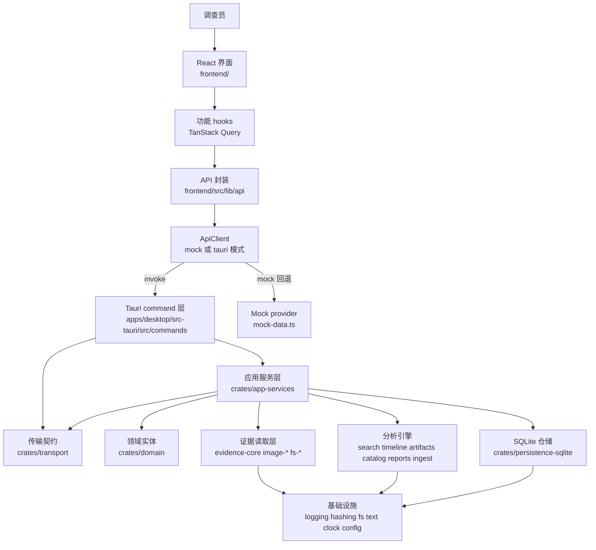

## 2. Rust Crate 依赖图

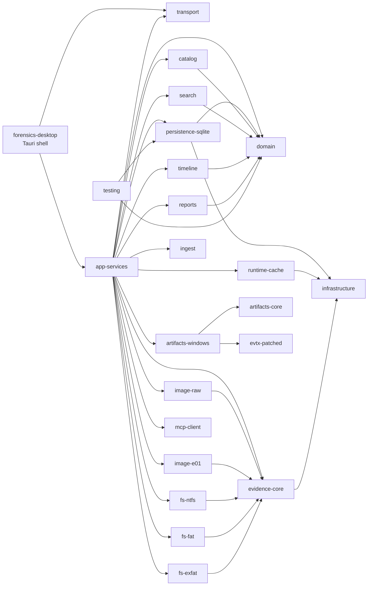

## 3. 核心领域 / 数据库模型 ER 图

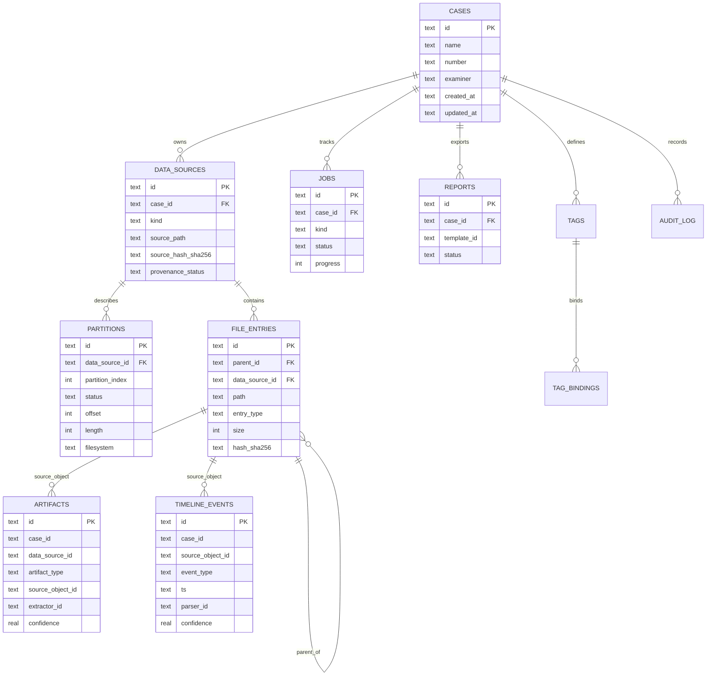

## 4. 前端状态与 API 调用链

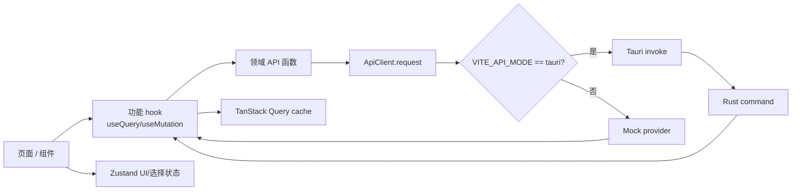

## 5. Tauri Command Request / Response 序列图

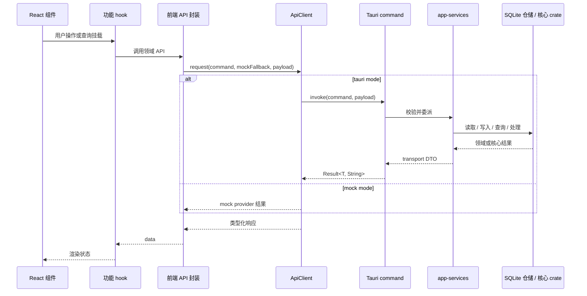

## 6. Backend Event Push 序列图

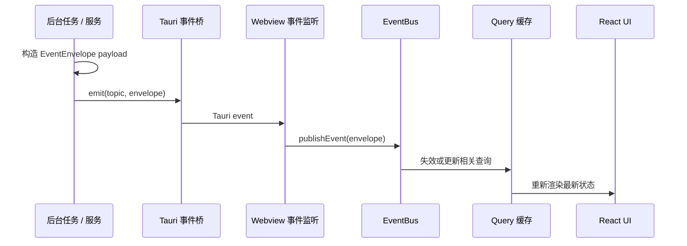

## 7. 数据源导入 / 镜像探测 / 分区识别

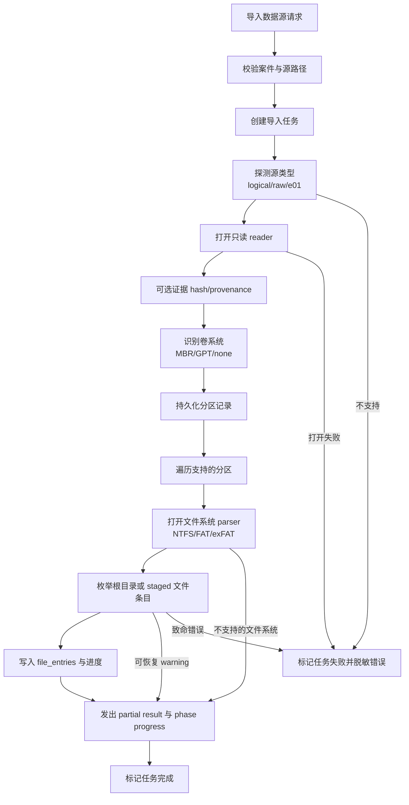

## 8. 文件系统枚举与目录树懒加载

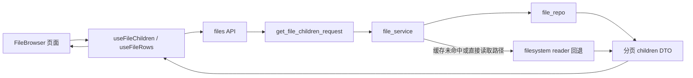

## 9. 搜索索引与查询流程

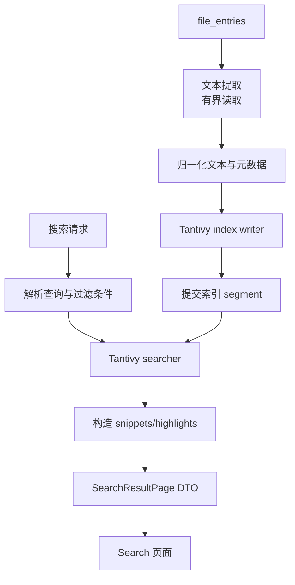

## 10. 时间线归一化与查询流程

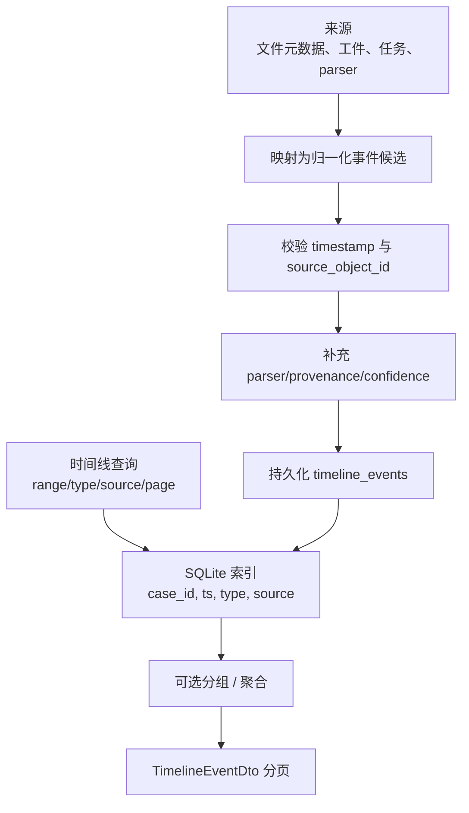

## 11. Windows Artifact 解析流程

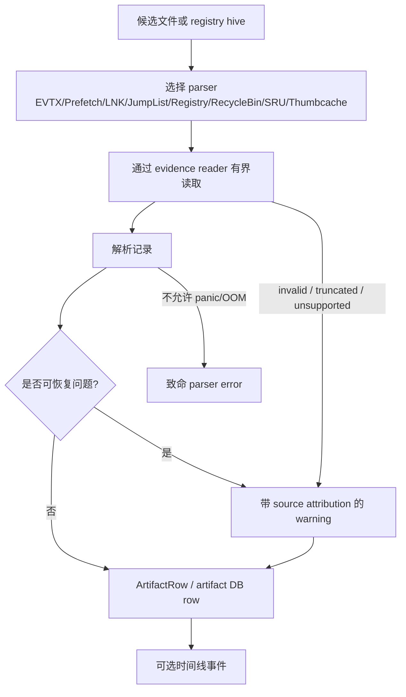

## 12. 报告导出流程

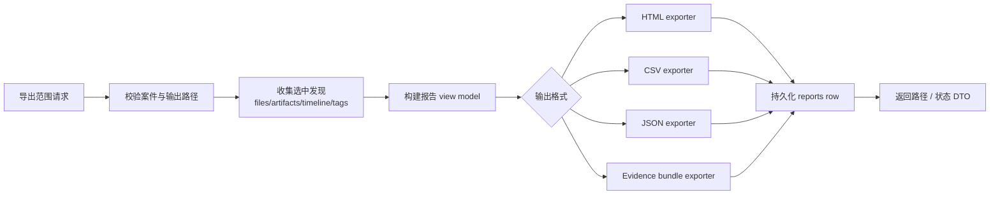

## 13. Job 任务状态机

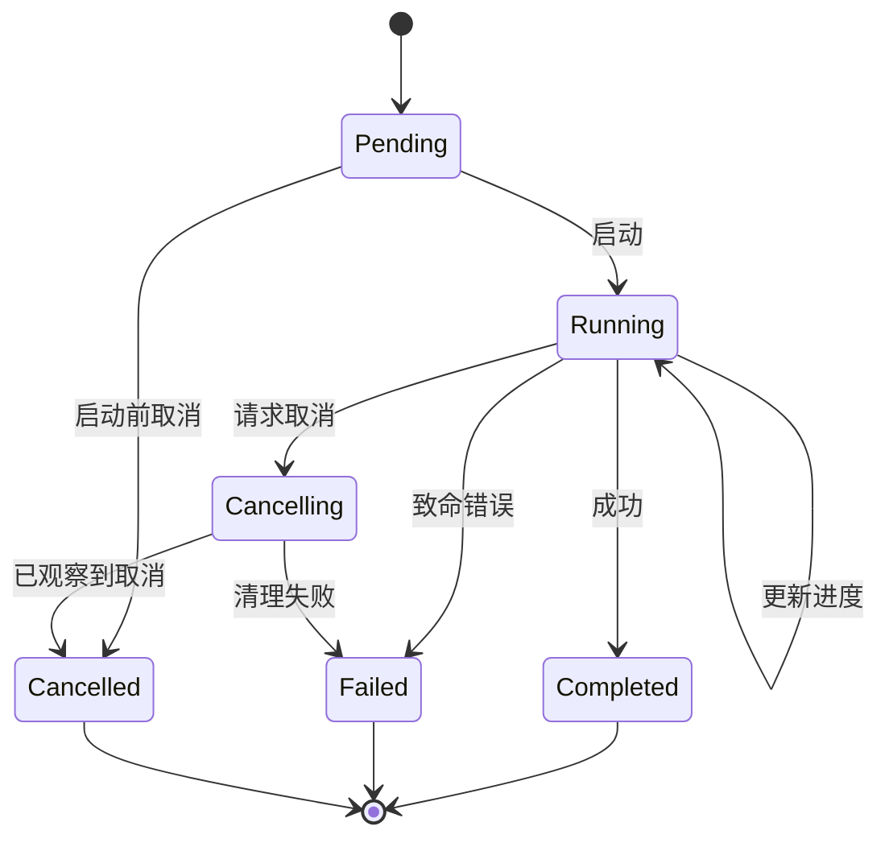

## 14. MCP 集成边界图

## 15. 审计使用说明

- 修改架构、契约、事件、导入、搜索、时间线、工件、报告或 MCP 时，先更新对应图，再更新实现或审计记录。
- Mermaid 图不替代代码审计；字段、索引、enum 和 payload 形状仍以源码和 migrations 为准。
- 图谱中出现的新边界若尚未实现，必须在正文标注为设计目标，避免误导为当前能力。
