# Forensics Workbench 模型 / 架构 / 算法图谱

本文档维护项目当前的 Mermaid 图谱，图谱以当前实现为准。

## 1. 分层架构图

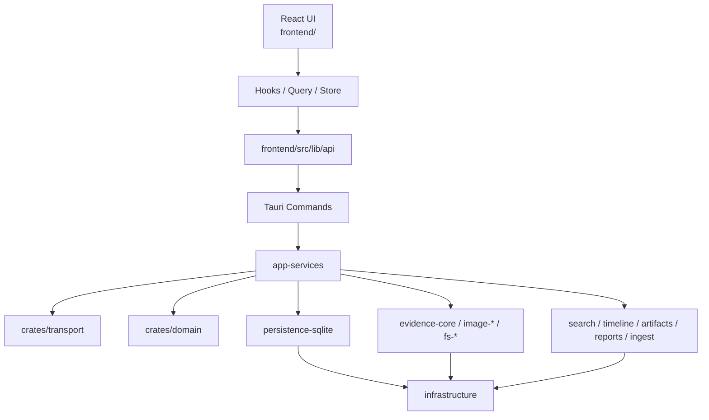

## 2. Rust crate 依赖图

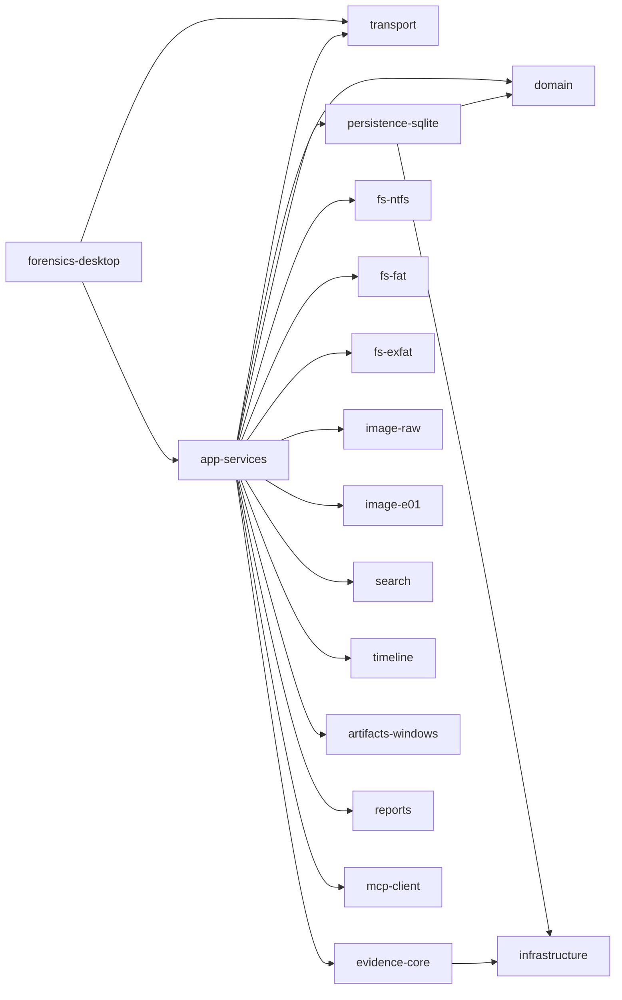

## 3. 核心领域 / 数据库模型 ER 图

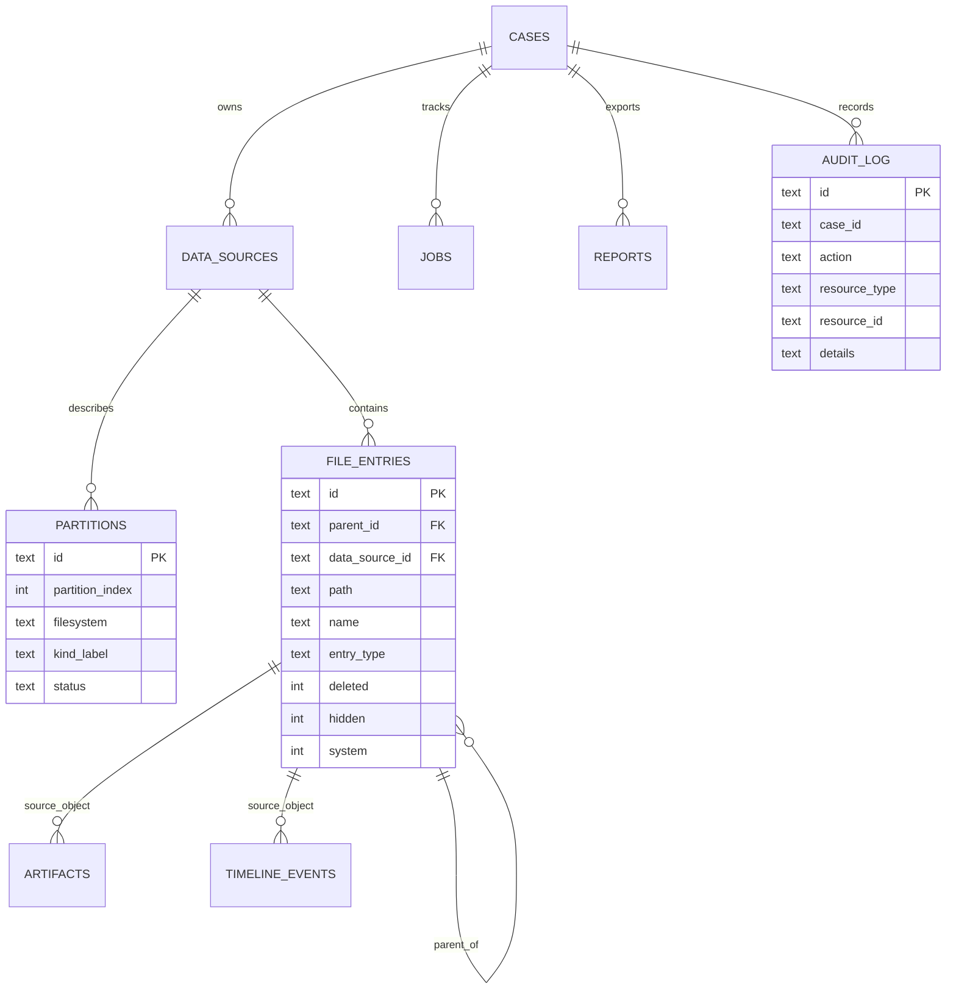

## 4. 前端状态与 API 调用链图

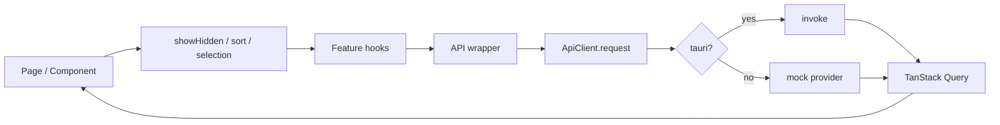

## 5. Tauri command request / response 序列图

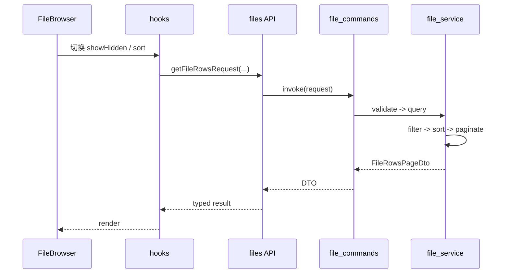

## 6. Backend event push 序列图

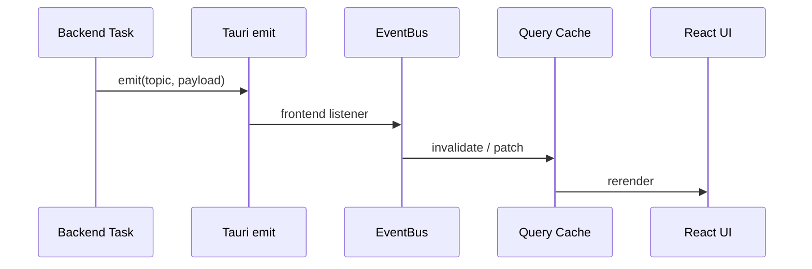

## 7. 数据源导入 / 镜像探测 / 分区识别流程图

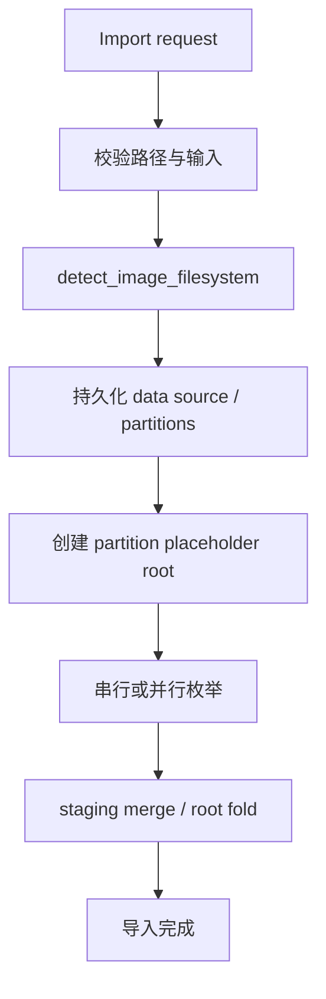

## 8. 文件系统枚举与目录树懒加载流程图

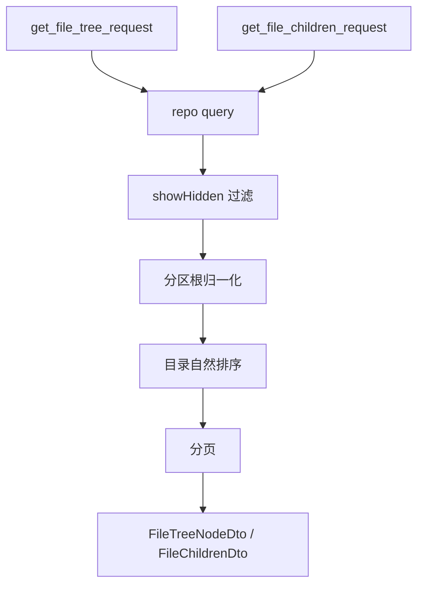

## 9. 搜索索引与查询流程图

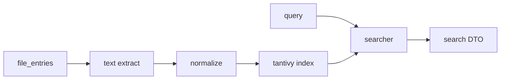

## 10. 时间线归一化与查询流程图

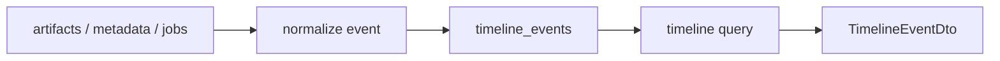

## 11. Windows artifact 解析流程图

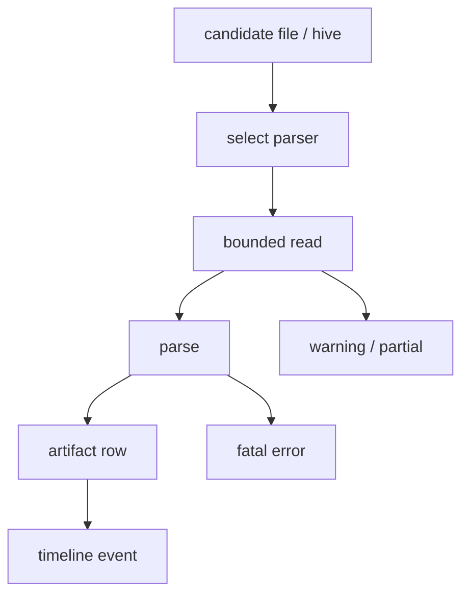

## 12. 报告导出流程图

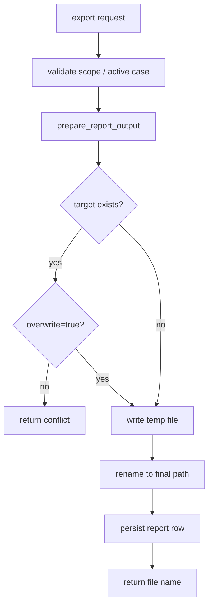

## 13. MCP 权限判定与审计图

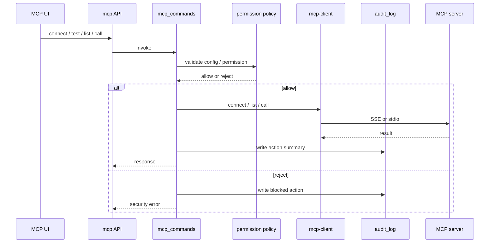

## 14. 可验证性体系与错误分类图

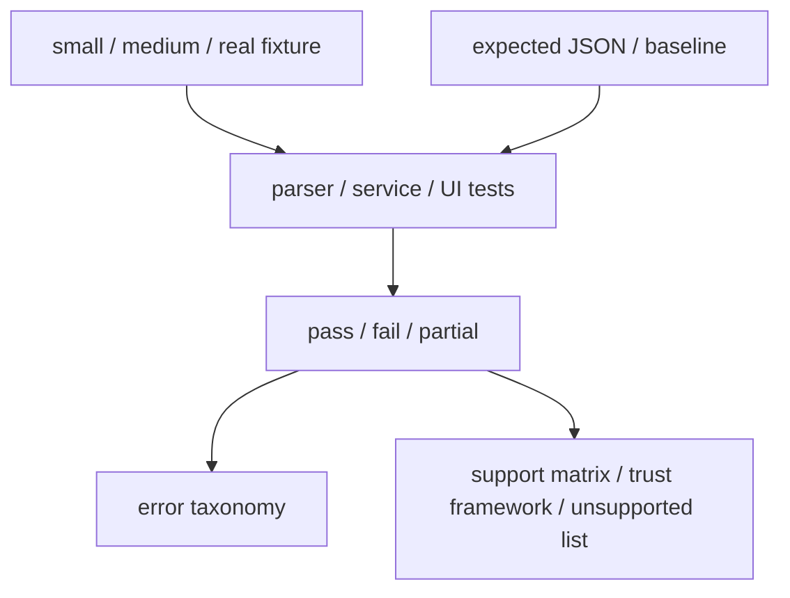

## 15. 维护说明

- 当前文档保持 `14` 个 Mermaid 图块，以配合防漂移脚本
- 图谱描述当前真实实现与确定的安全边界
- 如分区根模型、排序契约、MCP 权限、导出 overwrite 或验证体系变化，必须同步更新
