# Forensics Workbench 模型 / 架构 / 算法流程图

本文档集中维护 Forensics Workbench 的 Mermaid 图谱。图谱描述当前工程模型和关键链路，尤其覆盖分区根节点、文件浏览排序、状态字段传播和真实 Tauri 请求路径。字段细节仍以源码、迁移和 `crates/transport` 契约为准。

## 1. 分层架构图

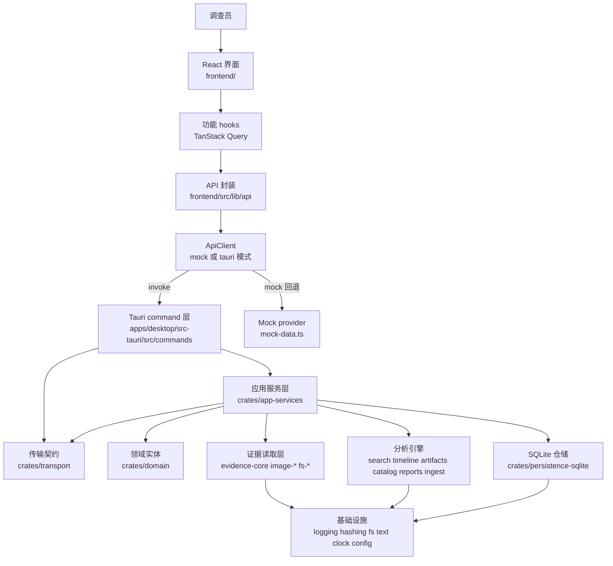

## 2. Rust Crate 依赖图

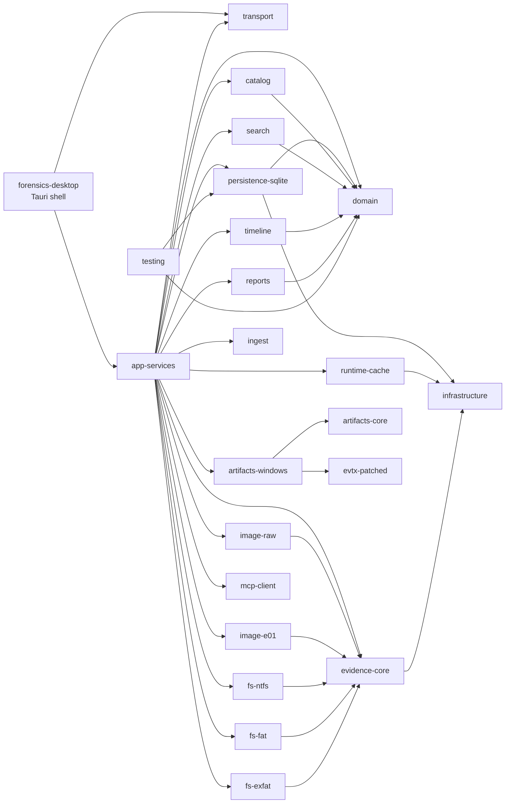

## 3. 核心领域 / 数据库模型 ER 图

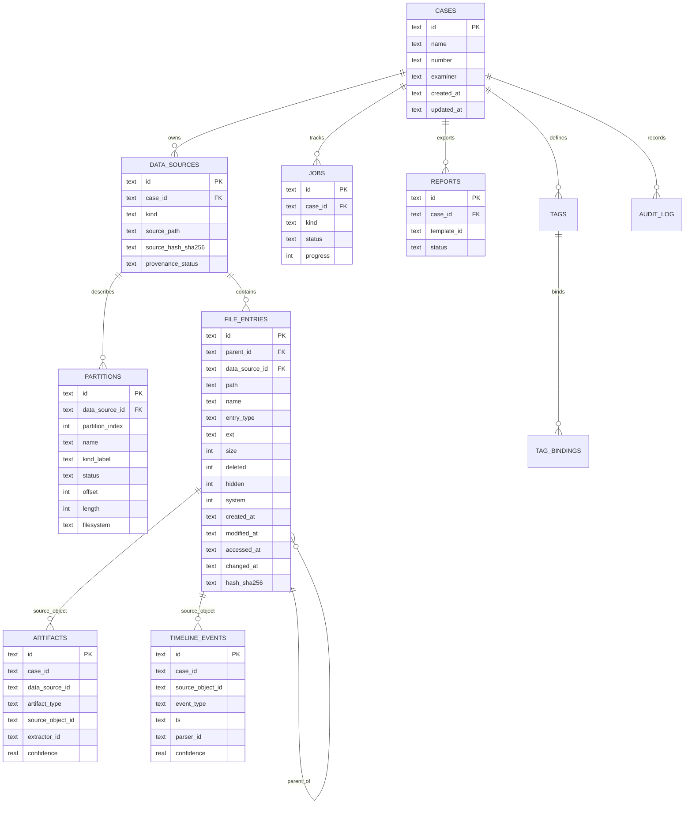

## 4. 前端状态与 API 调用链

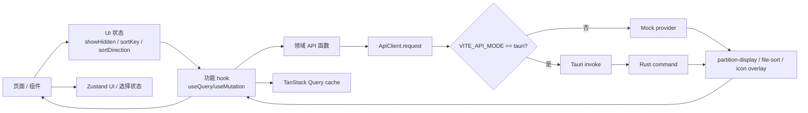

## 5. Tauri Command Request / Response 序列图

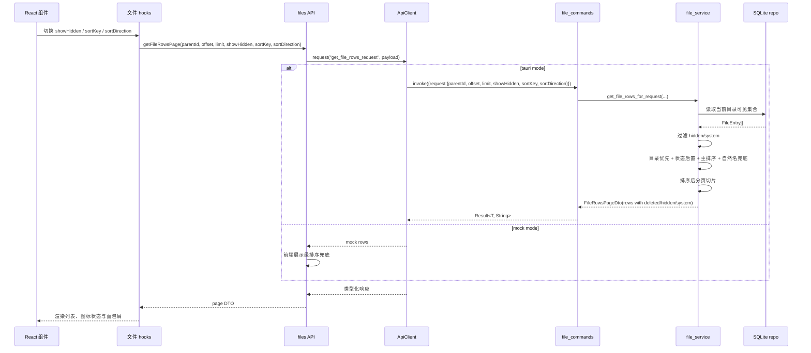

## 6. Backend Event Push 序列图

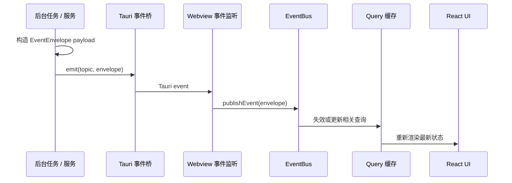

## 7. 数据源导入 / 镜像探测 / 分区识别

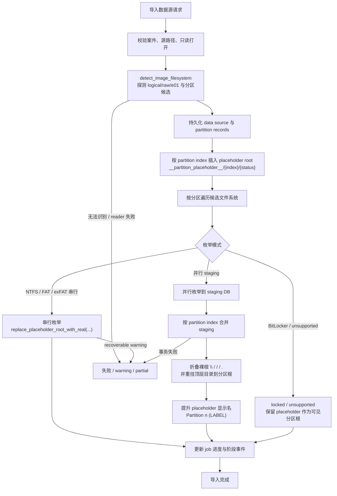

## 8. 文件系统枚举、树根归一化与文件浏览排序

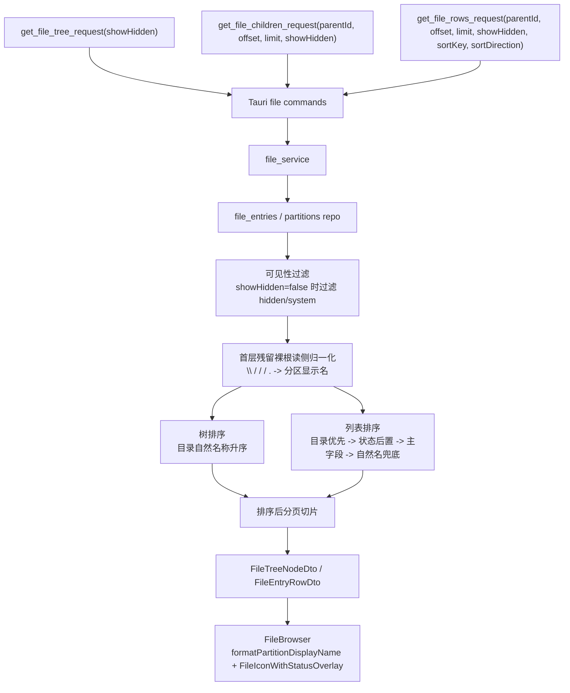

## 9. 搜索索引与查询流程

## 10. 时间线归一化与查询流程

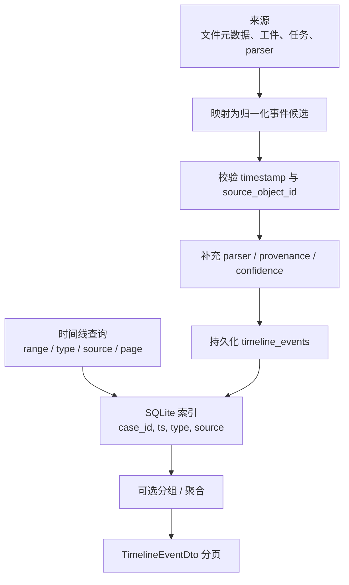

## 11. Windows Artifact 解析流程

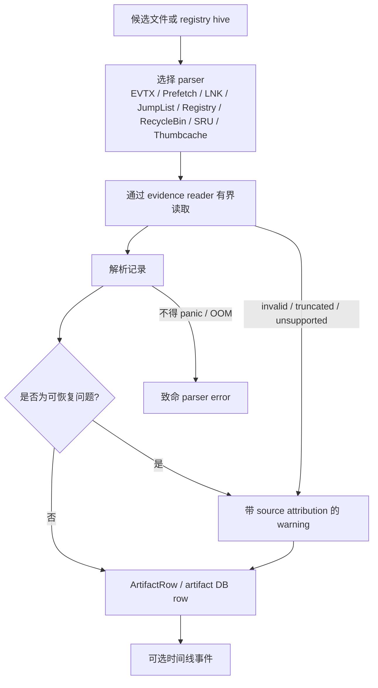

## 12. 报告导出流程

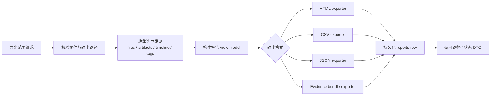

## 13. Job 任务状态机

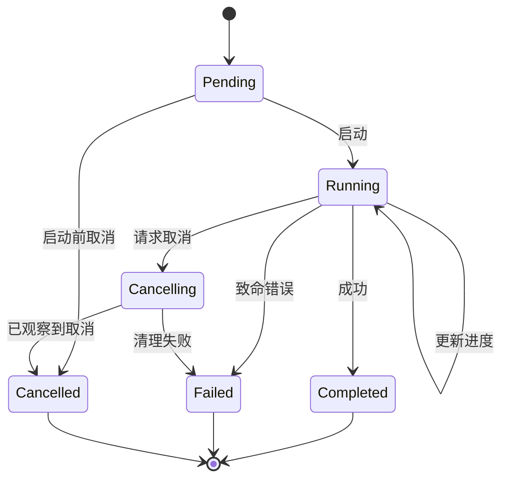

## 14. MCP 集成边界图

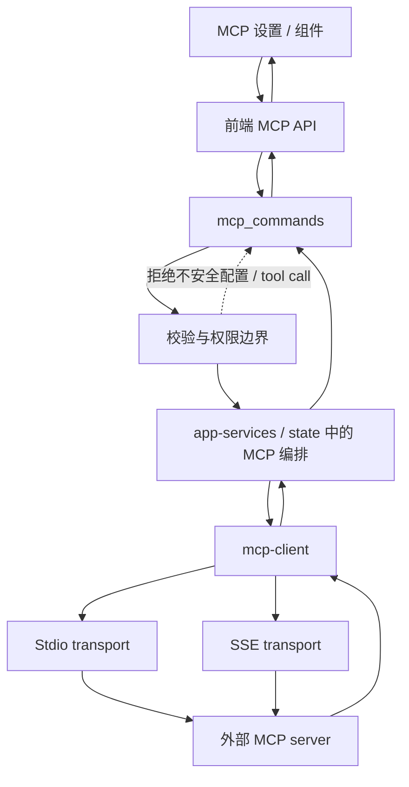

## 15. 审计使用说明

- 只要修改分区根模型、`showHidden`/排序契约、`deleted`/`hidden`/`system` 状态传播、导入 merge 规则或文件浏览读路径，就必须先同步本图谱。
- Mermaid 图不替代代码审计；字段、索引、状态枚举和 payload 形状仍以源码、迁移和 `crates/transport` 为准。
- 图谱只描述当前真实实现。尚未落地的想法应写入方案文档，不应混入这里伪装成既成事实。
